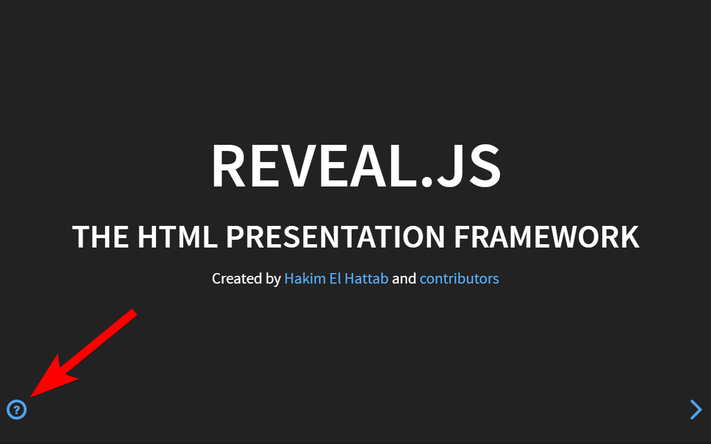

# HelpButton

A [reveal.js](https://github.com/hakimel/reveal.js/) 3.x / 4.x plugin to open the help screen by pressing a button.



This is handy if someone with no knowledge of reveal.js' keyboard shortcuts wants to view your presentation. The plugin can be configured when to show the button.

Works with all official themes.

## Installation

Copy this repository into the plugin folder of your reveal.js presentation, ie ```plugin/helpbutton```.

Add the plugin to the initialization of your presentation, as below.

### reveal 4.x

```javascript
<script src="plugin/helpbutton/helpbutton.js"></script>
// .. 
Reveal.initialize({
	// ...
	plugins: [
		// ..
		HelpButton,
	]
});
```

### reveal 3.x

```javascript
Reveal.initialize({
	// ...
	dependencies: [
		// ...
		{ src: 'plugin/helpbutton/helpbutton.js', async: true },
	]
});
```

## Usage

After installation the plugin works right out of the box.

### Configuration

You can configure some aspects of the plugin by adding the following options to your reveal configuration. Note that all configuration values are optional and will default to the values specified below.

```javascript
Reveal.initialize({
	// ...

	// Displays a help button in the lower left corner.
	// When pressed it shows the built-in reveal.js help screen.
	// Possible values:
	//   'none'      button will never been shown
	//   'first'     shows button on the very first slide
	//   'intro'     shows button on all slides of the first column of slides
	//   'always'    always shows the button on every slide
	helpButtonDisplay: 'first',
});
```

## API

### Javascript

The plugin API is accessible from the global ```HelpButton``` object.

```javascript
// Change a config value at runtime
HelpButton.configure({
	// Takes the same options as for configuration
	helpButtonDisplay: 'none',
});
```

## License

[MIT licensed](https://en.wikipedia.org/wiki/MIT_License).

Copyright (C) 2020 [Sören Weber](https://soeren-weber.de)
